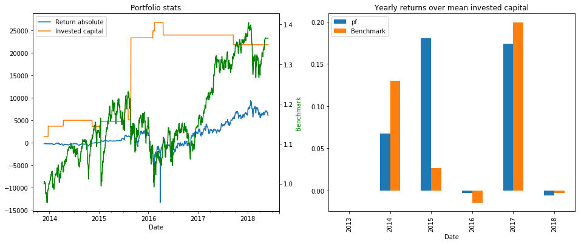
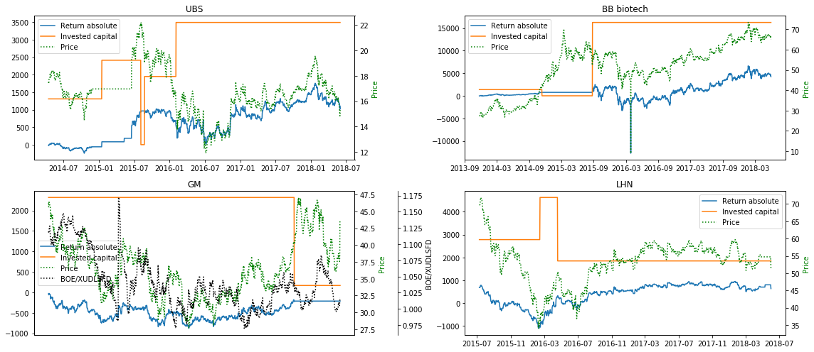

# Portfolio-management

## Overview
A small script I use to keep track of my stock portfolio. The data is obtained through two APIs: quandl [1] and alpha
vantage [2] (thanks to Romel Torres for his python wrapper [3]), following the severe restrictions in both google's and
yahoo finance's APIs recently. For both a free API key is available upon registering.

The idea was to create a periodic overview of my portfolio, its performance and account, accounting for all fees.
The focus is therefore simplicity of use. To account for backwards changes in price data the tables are constructed anew
at every request. Taking into account an in-built delay to the requests, building all overviews may take a minute if a
large number of stocks is included.

## Features
- Take into account payments into / out of the account associated with the portfolio
- Take into account any fees arising
- Comparison to a freely chosen benchmark
- Conversion of foreign currency stock into a base currency
- Overviews, including money weighted returns ("IRR" - internal rate of return) for:
    - aggregated portfolio (yearly and over time)
    - account balance
    - individual stocks
- Handle splits: just include the split ratio

For more details see the example notebook.

Requirements:
numpy, pandas, datetime, matplotlib, quandl, alpha vantage

### References
[1] https://www.quandl.com/
[2] https://www.alphavantage.co/documentation/
[3] https://github.com/RomelTorres/alpha_vantage
